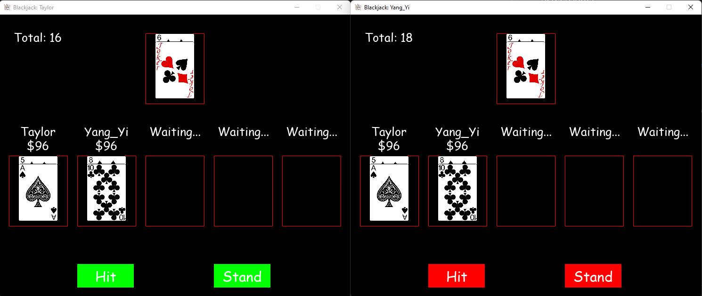

# Blackjack in Python
This is a basic multiplayer blackjack game made in python.

## Screenshots

<figcaption align = "center"><b>Screenshot 1</b></figcaption>

<figcaption align = "center"><b>Screenshot 2</b></figcaption>

## Required Libraries
* pygame
```
pip3 install pygame
```

## Usage
Currently, the game only supports up to 5 players.

### Server
The first script that should be launched is server.py
```
python3 server.py -lobby [lobby_id] -port
```
```-lobby``` is a unique identifying string such that people on the local network (or even from public if port forwarding is setup) cannot just randomly join the game. Note that the lobby ID shouldn't contain any spaces. If this is not included, there will not be a lobby_id set<br>
```-port``` turns on a flag that tells the program to pick an open port automatically. If this is not included, the program will automatically use port 5555 (by default) <br>
<br>
Once the script is launched, the server information is displayed on the screen.

Here, we can see that to connect to the server later (client), the lobby ID should be set to ALPACA, the server IP should be set to 10.5.0.2 and the server port should be set to 5555.

### Client
Once server.py is started, players can start connecting to the server to start the game.
```
python3 main.py -ip [id_addr] -port [port_no] -lobby [lobby_id] -name [usrname]
```
```-ip``` is the server's IP address. This field is required <br>
```-port``` is the port number for the server. If this is not included, the program will automatically assign the port number as 5555 <br>
```-lobby``` is the lobby ID of the server. If this is not included, the program will automatically assume that server doesn't have a lobby ID <br>
```-name``` is the your username. Note that there shouldn't be any spaces in your username. If this is not included, the program will automatically assign a username in the form of Player X, where X is the number of people who has tried to connect to the server. <br>
<br>
Taking the above scenario as an example, the following command should be typed into the terminal
```
python3 main.py -ip 10.5.0.2 -port 5555 -lobby ALPACA -name yangyi
```

### Admin (Not required to play the game)
An admin can also join the game session. To allow an admin to join the game,
```
python3 admin.py -ip [ip_addr] -port [port_no] -lobby [lobby_id]
```
This is similar to when the player joins. Once the admin joins, they are presented with a blank console. They can type the following commands. <br>
<br>
```shutdown``` command will quit the server instance. <br>
```set_money [player_id] [amount]``` will set [amount] of money for Player [player_id] whereby player_id=0 is the leftmost player and player_id=4 is the rightmost player.


## Credits
* <div>Icons made by <a href="https://www.flaticon.com/authors/darius-dan" title="Darius Dan">Darius Dan</a> from <a href="https://www.flaticon.com/" title="Flaticon">www.flaticon.com</a></div>
* <div>Cards are obtained from this website <a href="https://tekeye.uk/playing_cards/svg-playing-cards" title="cards">HERE</a></div>
* <div>Pygame Button Class: <a href="https://stackoverflow.com/questions/63435298/how-to-create-a-button-class-in-pygame" title="button class">HERE</a></div>
* <div>Networking tutorial: <a href='https://www.techwithtim.net/tutorials/python-online-game-tutorial/client/' title='networking'>HERE</a></div>
Also many thanks to fluffyadam for alpha testing my program and giving some of his input for making the game much better